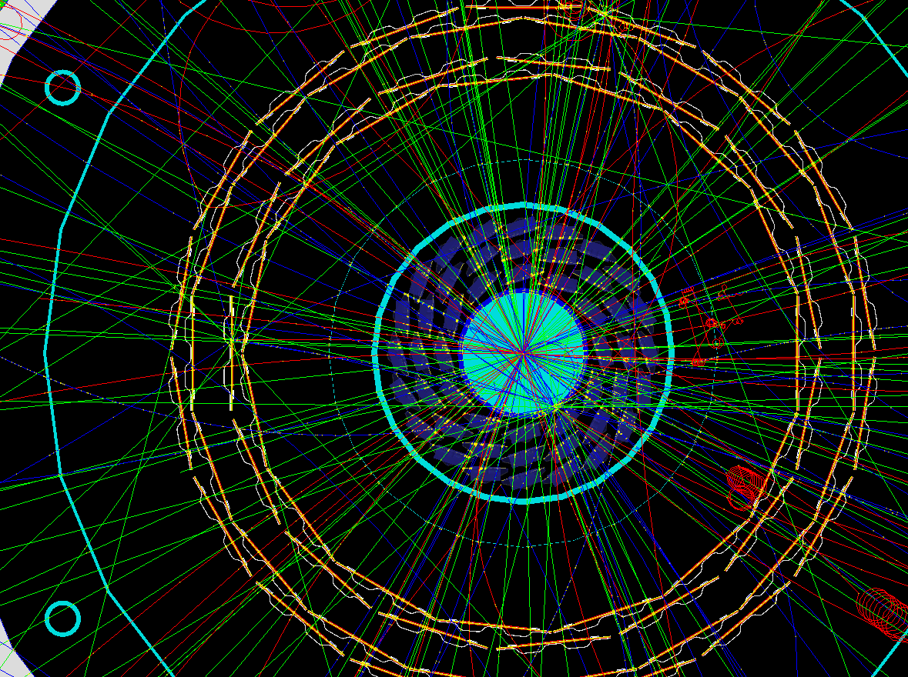

Welcome to sPHENIX Machine Learning Open Data Set for Tracking and Heavy Flavor Physics

## Introduction

[sPHENIX](https://www.sphenix.bnl.gov) is a new detector planned for the Relativistic Heavy Ion Collider facility at Brookhaven National Laboratory, NY, USA. We envision sPHENIX real-time electronics and data acquisition will process continuous detector input data stream at a few Tbps, reducing data by about one order of magnitude, and save data to disk at rate of O(100 Gbps). Beyond the sPHENIX baseline program, further data reduction at Tbps with advanced real-time computing on FPGA, GPU and CPU would open new physics opportunities at RHIC [example](https://indico.bnl.gov/event/5190/contributions/25240/). Therefore, we are publishing this data set to external machine learning scientists looking for collaboration and inputs. 

## Detector and events overview

There are three tracking detector subsystems in the [sPHENIX detector](https://indico.bnl.gov/event/4640/), [A Monolithic Active Pixel Sensor Vertex Detector (MVTX)](https://indico.bnl.gov/event/4072/), Intermediate Tracker (INTT), and a compact Time Projection Chamber (TPC). For the purpose of introducing this dataset, one can imaging them as 3-D cameras surrounding the collision point taking pictures of particles produced at the collision at 100kHz - 10Mhz frame rates. In the sPHENIX p+p physics program, the collision happens at 10 MHz rate with O(1-10) particles produced and traverse through these detectors after each collision. In order to separate out and to measure these particle trajectories precisely, the cameras is finally segmented. In particular, the MVTX detector contains O(200M) pixels. 

One high particle multiplicity event in the detector look like this: 

## Strategy overview

We expect there are at least two levels of learning algorithms, both has application in reducing and analyzing data when they stream from the detector:

1. Not all pixel hits belong to a reconstructable particle tracjectory. There are noise hits and backgroud hits which represents a significant fraction of the overall hit data rate. For a ML algorithm that can filter out these noise hit and perform some leading order reconstruction of particle tracjectory.
2. Algorithms could also learn features of the event and perform classification. This would allow us to filter out events of particular interest, such as those tagged as `D0toPiKInAcceptanceSignal: True` in this data set. 

## Data set 

This dataset is published at `/afs/rhic.bnl.gov/sphenix/simulations/HFMLTrigger`, which is world readable with [an AFS client](https://www.openafs.org/). It contains simulated sPHENIX events with p+p collision at 200 GeV c.m. energy in the MVTX detector only. We can also include other tracking detector data in the future if requested. 

It contains two categories of events in two sub folders, each contains 2M events: 

* `D0toPiKInAcceptanceSignal_Iteration2/` : all events has `D0toPiKInAcceptanceSignal: True` tag, which is the primary signal we are searching for. 
  * This data set represent simulation of 1% of `D0toPiKInAcceptanceSignal` data set we would expect from the sPHENIX physics program. 
* `InclusiveEvents_Iteration2/` : inclusive events, which are dominated by background events with every few signal events of `D0toPiKInAcceptanceSignal: True`. 
  * This data set represents about 0.2 second length of sPHENIX data during data taking. 
  * O(100) `D0toPiKInAcceptanceSignal` event show up there, representing the signal abundance of 10^-4

## Data format

Each data file is in self-explanatory [`JSON` format](https://www.json.org/) and compressed with [`bzip2` compressor](http://www.bzip.org/). An example file prior to compress is located at [`ExampleData/G4sPHENIX.root_HFMLTriggerInterface.json`](./ExampleData/G4sPHENIX.root_HFMLTriggerInterface.json) for your convenience.

Each file contains an array of `Events`. An event is described in four objects.
* `MetaData` records information including `EventID`, index ranges and truth collision vertex coordinate. 
* `TruthTriggerFlag` flags whether this event is of particular interest. Currently, only one classification flag is implimented `D0toPiKInAcceptance`.
* `RawHit` contains an array of hits which are the raw data output from the detector. This should be the main input to the algorithm
* `TruthHit` contains an array of `TruthTracks`, which represent the truth trajectories within that event. Each track contains list of hits indexes (`HitSequenceInEvent`) that can be found in `RawHit`, as well as more meta data describing truth features of the track. 

## Contact

Welcome to [contact us](https://www.sphenix.bnl.gov/web/contact) for any question or interest of collaboration. 

